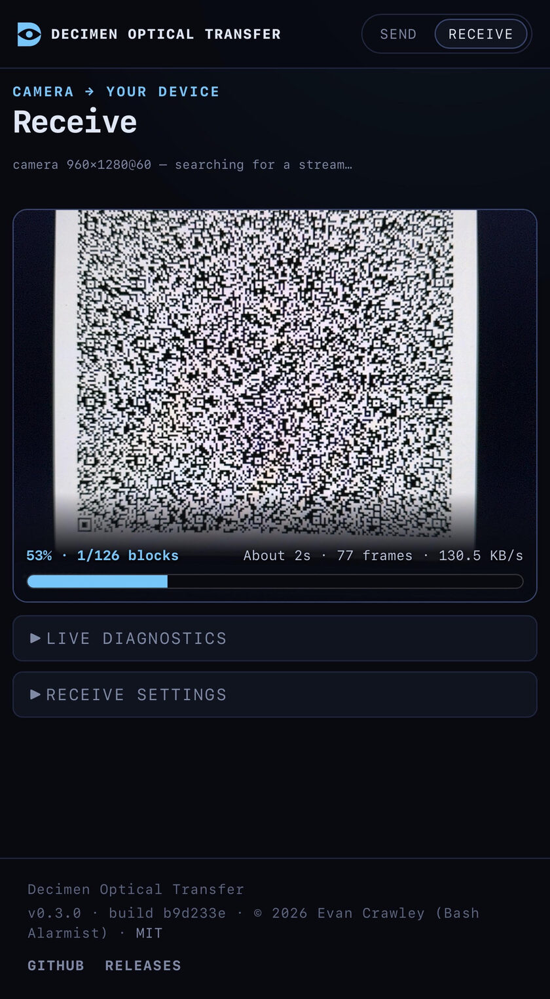

# Decimen Optical Transfer: fountain-coded QR file transfer


> **Field-use fork.** This fork adds an installable terminal sender for
> browserless and SSH machines, plus an explicit camera/lens selector for
> phones that open the wrong lens. It is based on Evan Crawley's MIT-licensed
> [Decimen Optical Transfer](https://github.com/bashalarmistalt/decimen-optical-transfer)
> and responds to upstream requests
> [#18](https://github.com/bashalarmistalt/decimen-optical-transfer/issues/18),
> [#16](https://github.com/bashalarmistalt/decimen-optical-transfer/issues/16),
> and [#23](https://github.com/bashalarmistalt/decimen-optical-transfer/issues/23).

Send a file between two devices using nothing but a **screen and a camera**.
One page displays the file as an endless stream of animated QR codes; another
device points its camera at it and reconstructs the file. **No network path
between the devices, no app, no pairing, no permissions beyond the camera.**
The payload travels as light.

## Try it

### Browser to phone

**→ [Open the field-use fork](https://caoshurong.github.io/decimen-optical-transfer/)**

Open it on both devices and go — nothing to install. Works offline after the
first visit, and installs as an app on both iOS and Android if you want it on
a home screen.

After camera permission is granted, open **Receive settings → camera** to see
and switch between the lenses exposed by the browser. The transfer decoder
keeps its progress while the camera restarts.

### Terminal or SSH machine to phone

Install the dependency-free CLI bundle from the release, then point the phone
receiver at the animated QR stream:

```bash
npm install --global https://github.com/CAOShurong/decimen-optical-transfer/releases/download/v0.4.0-field.1/decimen-optical-transfer-0.4.0-field.1.tgz
decimen send ./backup.tar.gz
```

It also accepts binary stdin, UTF-8 text, and an intentionally short convenience
command:

```bash
git bundle create - --all | decimen send - --name repository.bundle
decimen text "handoff note from the isolated machine"
decimen trans README.md       # existing path → file; anything else → text
```

The QR size adapts to the terminal, including a classic 80×24 SSH window. Use
`decimen send file --dry-run` to see the real compression, frame count, QR
footprint, and nominal capture time before displaying anything. Full guide:
[terminal sender](docs/user/terminal-sender.md).

Files up to 64 MB (or a pasted text snippet), filename and media type
preserved, gzip only when it helps, SHA-256 verified before anything is
offered — and received video plays right in the page. Extracted from a larger
experiment that reached **128 KB/s phone-to-phone**.

<p align="center">
  
</p>
<p align="center"><em>Mid-transfer: a phone pulling a file out of the air at 130 KB/s.</em></p>

Neither mode is encrypted: whatever is on the sending screen is readable by
any camera pointed at it. The property this gives you is no network, not
confidentiality — see [privacy](docs/user/privacy.md).

The receiver treats every scanned frame as untrusted input. Releases from
`v0.3.2-camera.1` onward reject inconsistent length headers before allocating a
decoder buffer; use the latest release and see [SECURITY.md](SECURITY.md) for
the supported-version and reporting policy.

## Documentation

**Using it** — [quick start](docs/user/quick-start.md) ·
[terminal sender](docs/user/terminal-sender.md) · [browser sending](docs/user/sending.md) ·
[receiving](docs/user/receiving.md) ·
[troubleshooting](docs/user/troubleshooting.md) ·
[install & offline](docs/user/install-and-offline.md) ·
[privacy](docs/user/privacy.md)

**How it's built** — [architecture](docs/technical/architecture.md) ·
[protocol](docs/technical/protocol.md) ·
[platform quirks](docs/technical/platform-quirks.md) ·
[build & release](docs/technical/build-and-release.md)

The short version of the protocol: a screen-to-camera link has no
back-channel, so the sender streams fountain-coded frames ([Luby
transform](https://en.wikipedia.org/wiki/Luby_transform_code)) — the receiver
collects *any* ~K·1.15 distinct frames in any order and peels the file out.
Dropped frames cost time, never correctness.

## Run it yourself

```bash
npm install
npm run dev               # https dev server with HMR
npm run serve             # build, then serve the production bundle
npm run demo              # demo mode: only the bundled payloads can be sent
npm test                  # golden wire-format vectors and unit tests
npm run build             # the hosted site → dist/
npm run build:cli         # installable terminal bundle → dist-cli/
npm run build:standalone  # both self-contained pages → dist-standalone/
npm run build:all         # everything
npm run verify:cli-package # pack, fresh-install, and exercise the real CLI artifact
```

Open `https://localhost:5173/send/` on the sending device and the printed
`Network` URL on the receiving phone (accept the self-signed certificate
once). Walkthrough: [quick start](docs/user/quick-start.md).

## Similar projects

The concept here was arrived at independently. It turns out several people
have had similar ideas, and their takes are all worth a look:

- [mohankumarelec/airgapped-qr-code-transfer](https://github.com/mohankumarelec/airgapped-qr-code-transfer):
  browser-based QR file transfer with compression and sequential chunking.
  Discovered after publicly demoing this project; convergent evolution in
  action.
- [divan/txqr](https://github.com/divan/txqr) (2018): animated QR plus
  fountain codes in Go, with two excellent write-ups on why fountain coding
  beats sequential looping.
- [sz3/libcimbar](https://github.com/sz3/libcimbar): goes past QR entirely
  with a custom high-density color code purpose-built for this channel.

The original project was built by
[Evan Crawley (Bash Alarmist)](https://www.linkedin.com/in/evan-crawley). This
field-use fork is maintained by [CAOShurong](https://github.com/CAOShurong),
with [node-qrcode](https://github.com/soldair/node-qrcode) and
[zxing-wasm](https://github.com/Sec-ant/zxing-wasm). Bundled CLI notices are in
[THIRD_PARTY_NOTICES.md](THIRD_PARTY_NOTICES.md).

## License

MIT
